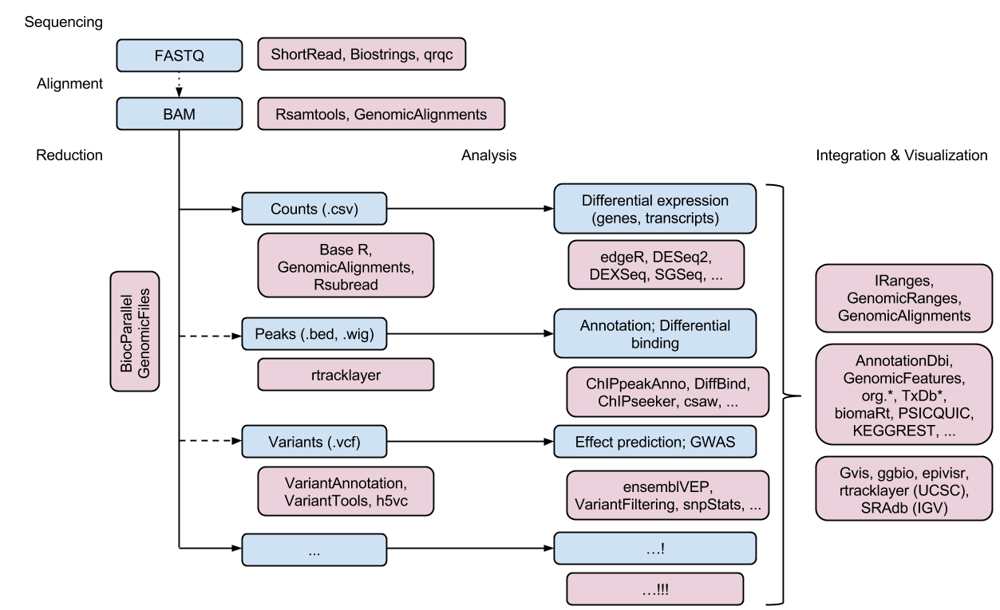

# Bioinformatics with R

## Bioconductor project

The goal of the Bioconductor project is to advance statistical analysis and understanding of existing and upcoming high-throughput biological experiments. Bioconductor is based on packages written primarily in the R programming language. Bioconductor is committed to open source, collaborative, distributed software development literate and reproducible research. Enabling user and developer communities is an essential part of our mission. Scientific, Technical and Community Advisory Boards provide project oversight.

- [Bioconductor webpage](https://bioconductor.org/)

## Sequence analysis

Go to the workflow package description page developed by Sonali Arora and Martin Morgan with the title "introduction to bioconductor for sequence data" to see a list of the most important packages necessary to deal with sequences in each stage. (https://www.bioconductor.org/packages/release/workflows/vignettes/sequencing/inst/doc/sequencing.html)

Reading the Documents provided for all of those packages is essential for effective analysis of the sequencing data.

#### Packages needed for sequencing:

- [ShortRead](https://bioconductor.org/packages/release/bioc/manuals/ShortRead/man/ShortRead.pdf)
- [Biostrings](https://bioconductor.org/packages/release/bioc/manuals/Biostrings/man/Biostrings.pdf)
- [seqinr](https://cran.r-project.org/web/packages/seqinr/seqinr.pdf)
- [biomaRt](https://bioconductor.org/packages/release/bioc/manuals/biomaRt/man/biomaRt.pdf)

#### Packages needed for alignment

- [Biostrings](https://bioconductor.org/packages/release/bioc/manuals/Biostrings/man/Biostrings.pdf)
- [Rsamtools](https://bioconductor.org/packages/release/bioc/manuals/Rsamtools/man/Rsamtools.pdf)
- [GenomicAlignments](https://bioconductor.org/packages/release/bioc/manuals/GenomicAlignments/man/GenomicAlignments.pdf)
- [muscle](https://www.bioconductor.org/packages/release/bioc/manuals/muscle/man/muscle.pdf)

## Microarray analysis

array is a bioconductor workflow package developed to analysis of expression arrays. Reading the manual page for this package gives a comprehensive overview of the workflow. 
- [arrays](https://www.bioconductor.org/packages/release/workflows/vignettes/arrays/inst/doc/arrays.html)
#### packages needed for microarray analysis:

In order to learn the process go the html page for the workflow package of RNAseq123.

- [RNAseq123](https://www.bioconductor.org/packages/release/workflows/vignettes/RNAseq123/inst/doc/limmaWorkflow.html)

- [affy](https://www.bioconductor.org/packages/release/bioc/manuals/affy/man/affy.pdf) 
- [arrayQualityMetrics](https://bioconductor.org/packages/release/bioc/manuals/arrayQualityMetrics/man/arrayQualityMetrics.pdf)
- [limma](https://bioconductor.org/packages/release/bioc/manuals/limma/man/limma.pdf)
- [glimma](https://www.bioconductor.org/packages/release/bioc/manuals/Glimma/man/Glimma.pdf)
- [edgeR](https://www.bioconductor.org/packages/release/bioc/manuals/edgeR/man/edgeR.pdf)
- [sva](https://bioconductor.org/packages/release/bioc/manuals/sva/man/sva.pdf)

#### books 
- [Bioconductor case studies](https://www.bioconductor.org/help/publications/books/bioconductor-case-studies/)

#### publications
- [Ritchie ME, Phipson B, Wu DI, Hu Y, Law CW, Shi W, Smyth GK. limma powers differential expression analyses for RNA-sequencing and microarray studies. Nucleic acids research. 2015 Apr 20;43(7):e47-.](https://pubmed.ncbi.nlm.nih.gov/25605792/#)
- [Hänzelmann S, Castelo R, Guinney J. GSVA: gene set variation analysis for microarray and RNA-seq data. BMC bioinformatics. 2013 Dec;14(1):1-5.](https://pubmed.ncbi.nlm.nih.gov/23323831/) 
- [Mastriani E, Zhai R, Zhu S. Microarray-based microRNA expression data analysis with bioconductor. InTranscriptome Data Analysis 2018 (pp. 127-138). Humana Press, New York, NY.](https://pubmed.ncbi.nlm.nih.gov/29508294/)

## Analyzing GWAS data

- [SNPassoc](https://cran.r-project.org/web/packages/SNPassoc/SNPassoc.pdf)
- [GenABEL]
- [GWASTools](https://www.bioconductor.org/packages/release/bioc/html/GWASTools.html)
- [GWASdata](http://bioconductor.org/packages/release/data/experiment/html/GWASdata.html)
- [NCBI2R]
- [GWASExactHW](https://cran.rstudio.com/web/packages/GWASExactHW/index.html)
- [CNVassoc](https://cran.r-project.org/web/packages/CNVassoc/index.html)
- [gap](https://cran.r-project.org/web/packages/gap/index.html)
- [postgwas](https://cran.r-project.org/web/packages/postgwas/index.html)
- [taRifx](https://cran.r-project.org/web/packages/taRifx/index.html)

## Analyzing Mass Spectrometry Data

The workflow package "proteomics"  written by Laurent Gatto provides a comprehensive overview of the process of Mass Spectormetry data analysis. 
- [proteomics](https://www.bioconductor.org/packages/release/workflows/html/proteomics.html)

- readMxXmlData
- [mzR](https://bioconductor.org/packages/release/bioc/html/mzR.html)
- [readBrukerFlexData](https://cran.r-project.org/web/packages/readBrukerFlexData/index.html)
- [MALDIquantForeign](https://cran.r-project.org/web/packages/MALDIquantForeign/index.html)
- [MALDIquant](https://cran.r-project.org/web/packages/MALDIquant/index.html)
- [protViz](https://cran.r-project.org/web/packages/protViz/index.html)

## Analyzing NGS data

In order to have an overview of the process visit biocondutor turial for NGS analysis with R and Bioconductor; 
- [bioconductor tutorial](https://bioconductor.org/help/course-materials/2012/CSC2012/Bioconductor-tutorial.pdf)

- [SRAdb](https://bioconductor.org/packages/release/bioc/html/SRAdb.html)
- [Rsamtools](https://bioconductor.org/packages/release/bioc/html/Rsamtools.html); link to source package: git clone git@git.bioconductor.org:packages/SRAdb
 
- [Shortread](https://bioconductor.org/packages/release/bioc/html/ShortRead.html)
- [edgeR](https://www.bioconductor.org/packages/release/bioc/manuals/edgeR/man/edgeR.pdf)
- [limma](https://bioconductor.org/packages/release/bioc/manuals/limma/man/limma.pdf)
- [DESeq](https://www.bioconductor.org/packages//2.10/bioc/html/DESeq.html)
- [pasilla](https://bioconductor.org/packages/release/data/experiment/html/pasilla.html)
- [goseq](https://bioconductor.org/packages/release/bioc/html/goseq.html)
- [methylAnalysis](https://www.bioconductor.org/packages/release/bioc/html/methyAnalysis.html)
- [chipseq](https://www.bioconductor.org/packages/release/bioc/html/chipseq.html)

### publications

- [Sepulveda JL. Using R and Bioconductor in clinical genomics and transcriptomics. The Journal of Molecular Diagnostics. 2020 Jan 1;22(1):3-20.](https://pubmed.ncbi.nlm.nih.gov/31605800/)
- 

## contribute to the bioconductor

