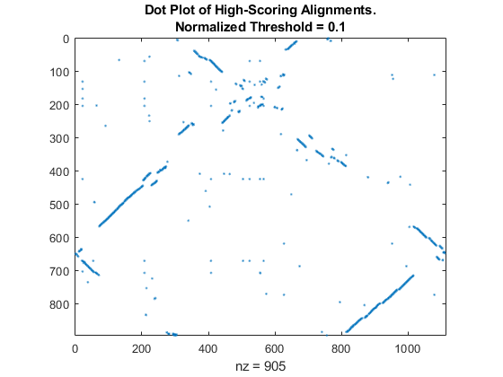

# Bioinformatics with MATLAB

## Sequence analysis

- 

refer to the relative section in the mathwork examples

## Microarray analysis

- 

## NGS analysis

- 

## Articles that have used MATLAB for analysis

bring articles in feature examples of the mathwork guides
Papers that recently used matlab in thier analysis: search pubmed: MATLAB

## Latest news:

Find latest news and write them here
