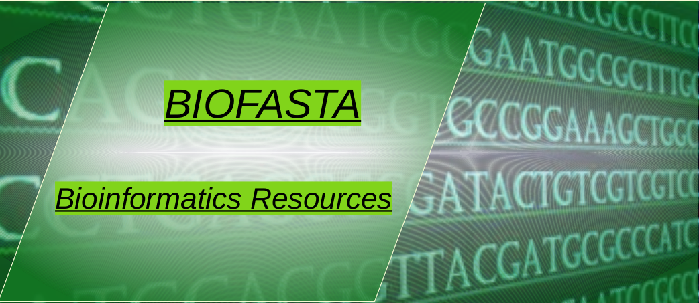

Because of advances in molecular biology, particularly sequencing technologies, the volume of biological data has dramatically increased in the last decade. The management and interpretation of biological data has become increasingly difficult as the volume of data has grown. In order to do analysis, molecular biologists need computational tools. Bioinformatics is a relatively new discipline that focuses on building the tools and software needed to make the most of data. We hope to collect and offer the most significant tools needed to conduct a given activity on genomes and proteomics data on this website. We'll show you how to do biological analysis using apps developed in the four most popular programming languages.

-------------------------------------------------------

Python
---------

Python is an object-oriented, interpreted, flexible language that is becoming increasingly popular for scientific computing. Python is easy to learn, has a very clear syntax and can easily be extended with modules written in C, C++ or FORTRAN. Python's recent rise in popularity is closely linked to its role as the primary programming language for big data. Bioinformatics is one of the most advanced uses of data science due to the deluge of data in biology, mostly from genomics and proteomics. Python is one of the most important tools for bioinformatists to use when analysing their data.

- [Bioinformatics with Python](advancedbioinformatics-python/index.md)

---------------------------------------------------------

R
-----

R is a language and environment for statistical computing and graphics. It is a GNU project which is similar to the S language and environment which was developed at Bell Laboratories (formerly AT&T, now Lucent Technologies) by John Chambers and colleagues. It provides a wide variety of statistical (linear and nonlinear modelling, classical statistical tests, time-series analysis, classification, clustering, …) and graphical techniques, and is highly extensible. One of R’s strengths is the ease with which well-designed publication-quality plots can be produced, including mathematical symbols and formulae where needed. R is available as Free Software under the terms of the Free Software Foundation’s GNU General Public License in source code form. It compiles and runs on a wide variety of UNIX platforms and similar systems (including FreeBSD and Linux), Windows and MacOS.

All of these features made R an ideal environment for bioinformatists to handle biological data, particularly high throughput genomics data.  

- [Bioinformatics with R](advancedbioinformatics-R/index.md)

------------------------------------------------------------

MATLAB                      
----------

Most of the scientists and engineers use MATLAB for analyzing and visualizing data. MATLAB as a programming language can also be used for handling biological data. Most of the bioinformaticians use the capabilities of this language to perform some of the tasks that could be more complicated on other programming languages. MATLAB codes can be integrated with other programming languages, which makes it even more powerful in performing advanced bioinformatics, such as big data analysis. In order to learn the basics of MATLAB visit [mathworks website](https://www.mathworks.com/help/matlab/index.html).

Bioinformatics toolbox of the MathWorks, provide algorithms and apps for advanced bioinformatics such as Next Generation Sequencing (NGS), microarray analysis, mass spectrometery and gene ontology. Using toolbox functions, you can read all biological data and interact with biological databases. Furthermore, you would be able to to analyse and visualize them effectively. In order to learn about bioinformatics toolbox of MathWorks, visit its [website](https://www.mathworks.com/help/bioinfo/).

- [Bioinformatics with MATLAB](advancedbioinformatics-matlab/index.md)

-------------------------------------------------------------

Perl 
-------

Before Python and R tools in bioinformatics became popular, bioinformatists used to work with Perl in order to write scripts and applications to carry out their needs. Perl is a very powerful language, particularly in handling text, which is mostly required by biologists, because of nucleotide and protein sequences.  Actually, the language was originally created for parsing files and quickly creating formatted reporting. The name "Perl" stands for "Practical Extraction and Reporting Language". The program has a very powerful regular expression capability for pattern matching, as well as built-in file manipulation. These abilities have proven invaluable for bioinformatics. Nearly every bioinformatist has written a program to parse a nucleotide sequence into a reverse complement sequnece. 

- [Bioinformatics with Perl](bioinformatics-Perl/index.md)

